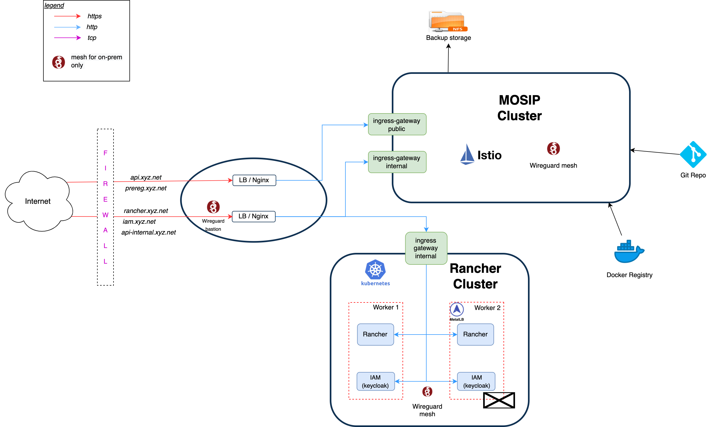

# Kubernetes Infrastructure

## Overview
This repo contains architecture and instructions to install Kubernetes based clusters for MOSIP deployment. The deployment consists of following clusters:
1. **Rancher cluster**: Rancher is used for cluster administration and [RBAC](https://kubernetes.io/docs/reference/access-authn-authz/rbac/). One Rancher can manage multiple MOSIP clusters and hence a single organisation wide installation of this cluster would suffice.
1. **MOSIP cluster**:  All MOSIP modules run on this cluster. Each installation of MOSIP for development, testing, staging, production etc. would have a cluster each. 

The clusters may be installed on cloud or on-premise (on-prem).

## Cloud versus on-prem
There are certain differences between cloud and on-prem deployments. Few of them are given below:
|Feature|Cloud|On-prem|
|---|---|---|
|K8s cluster|Cloud provider provisioned. Eg. EKS on AWS, AKS on Azure|Native, eg. using [Rancher RKE](https://rancher.com/docs/rke/latest/en/)|
|Load balancer|Automatic provision of loadbalancer|Nginx|
|TLS termination|Cloud loadbalancer|Nginx|
|Inter-node Wireguard network|Not compatible|Works well|
|Storage|Cloud storage like EBS on AWS|[Longhorn](cluster/longhorn) or [NFS](https://en.wikipedia.org/wiki/Network_File_System)|

## Installation
Following install sequence is recommended:
* [Rancher cluster](rancher/README.md) 
* [MOSIP cluster](mosip/README.md)
* [Monitoring](monitoring/README.md)
* [Alerting](monitoring/alerting/README.md)
* [Logging](logging/README.md)

