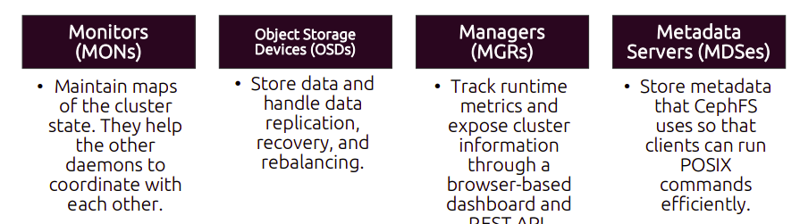
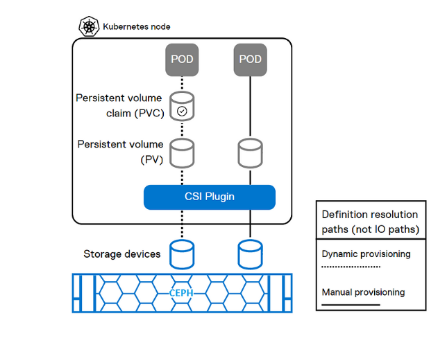

# Ceph Storage

Ceph Storage is a highly scalable and distributed data object store designed to provide
excellent performance, reliability, and scalability. It's a technology which is used in data centers to store and manage all sorts of digital information such as files, databases and virtual machine data.

### Introduction

Ceph: Ceph is a powerful and scalable storage system used in data centers. It provides storage for things like files, databases, and virtual machines.

Csi: Container Storage Interface is a standard for how storage systems (like Ceph) can talk to container orchestrators (like Kubernetes). It makes it easier for containers to use storage.

Ceph-Csi: Ceph CSI is a specific implementation that connects Ceph storage to container orchestrators using the CSI standard. It enables containers to easily use Ceph storage for their data.

### Working of Ceph-csi

The Ceph CSI (Container Storage Interface) driver works as a bridge between container orchestrators like Kubernetes and the Ceph storage system, allowing containers to efficiently access and use Ceph storage. Here's a simplified explanation of how Ceph CSI works:

* Set up Ceph Cluster: Start by setting up a Ceph cluster according to your specific requirements. This involves deploying the following daemons and configuring the cluster network.
  

* Ceph CSI Driver Deployment: We deploy the Ceph CSI driver into your container orchestration environment, such as Kubernetes. The driver is responsible for facilitating communication between your containers and the Ceph storage cluster.

* Create Storage Classes: Storage Classes define the properties of the storage volumes to be provisioned.

* Provision Persistent Volumes: Once the Storage Class is defined, you can create Persistent Volume Claims (PVCs) to request storage resources.

* Volume Management: The Ceph CSI driver also manages the lifecycle of these volumes. It ensures that when the pod is deleted or the PVC is released, the storage is properly detached, and any associated resources are cleaned up.

In summary, Ceph CSI simplifies how containers interact with Ceph storage in a container orchestration environment. It streamlines the process of provisioning, attaching, and managing storage volumes, allowing containerized applications to easily access and use the storage resources provided by the Ceph cluster. This dynamic provisioning and management reduce the administrative burden and make it easier to scale containerized applications while efficiently using Ceph storage.

### Ceph Storage Cluster

A Ceph Storage Cluster is the deployment of two daemon types: one or more Ceph monitors and two or more Ceph object storage devices. The Ceph Storage Cluster is the foundation for all Ceph deployments and could contain thousands of storage devices.

Here's a brief overview of how a Ceph storage cluster works:

1. Architecture: A Ceph cluster typically consists of three main components:

   * Ceph OSD (Object Storage Daemon): OSDs are responsible for storing data, handling data replication, recovery, and rebalancing tasks. They manage storage devices (such as hard drives or SSDs) attached to each storage node.
   
   * Ceph Monitor: Monitors maintain cluster membership, monitor OSD status, and manage cluster configuration. They keep track of the cluster map and help clients locate data.

   * Ceph Manager: Managers provide monitoring, logging, and management services for the cluster. They also interface with external systems and provide metrics for monitoring purposes.

  
2. CRUSH Algorithm: Ceph uses the CRUSH (Controlled Replication Under Scalable Hashing) algorithm to determine data placement and distribution across the cluster. CRUSH ensures that data is distributed evenly across OSDs while maintaining fault tolerance and avoiding hotspots.

3. RADOS (Reliable Autonomic Distributed Object Store): RADOS is the core storage layer of Ceph. It provides the distributed object storage infrastructure upon which Ceph is built. RADOS abstracts storage devices into logical storage pools, called RADOS Pools, and stores data as objects. 

4. Ceph RBD (RADOS Block Device): Ceph RBD allows users to create virtual block devices that can be used like traditional block devices (e.g., hard drives or SSDs). RBD volumes are thinly provisioned and can be dynamically resized.

5. CephFS (Ceph File System): CephFS is a distributed file system built on top of Ceph's RADOS layer. It provides a POSIX-compliant file system interface and supports features like file-level snapshots, quotas, and access control lists (ACLs).

6. Scalability and Redundancy: Ceph clusters can scale from a few nodes to thousands of nodes seamlessly. They offer high availability and data redundancy through data replication across multiple OSDs and failure domains.

Overall, a Ceph storage cluster provides a robust, scalable, and flexible storage solution suitable for a wide range of use cases, including cloud storage, virtualization, and big data analytics.

### Ceph Access Methods

Ceph provides the following methods for accessing a Ceph cluster:
  - Ceph Native API (librados)
  - Ceph Block Device (RBD, librbd), also known as a RADOS Block Device (RBD) image
  - Ceph Object Gateway
  - Ceph File System (CephFS, libcephfs)

### Strategies for Data Distribution and Organization

  - Partitioning Storage with Pools
  - Placement Groups
  - Mapping Objects to OSDs
  - Data Protection