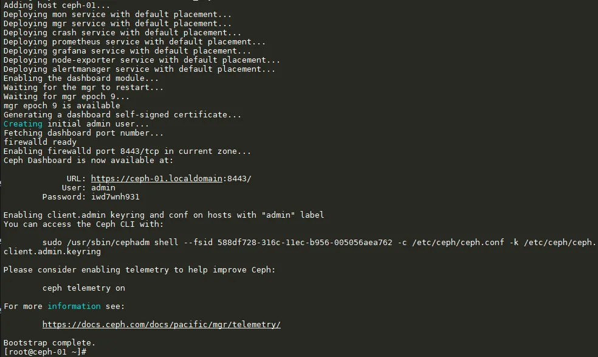
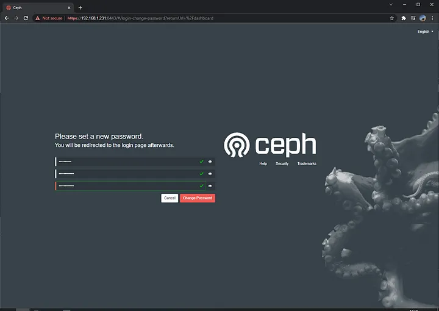
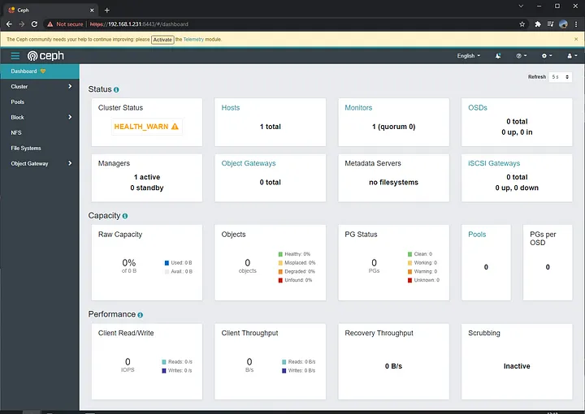
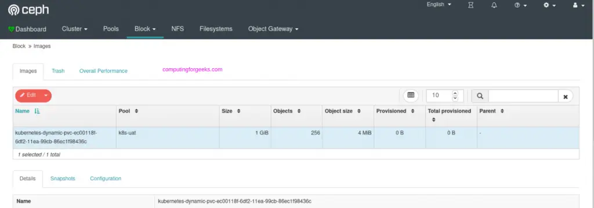

# Installing Ceph

There are multiple ways to install Ceph.

* Cephadm: It is a tool that can be used to install and manage a Ceph cluster.
  - cephadm supports only Octopus and newer releases.
  - cephadm is fully integrated with the orchestration API and fully supports the CLI and dashboard features that are used to manage cluster deployment.
  - cephadm requires container support (in the form of Podman or Docker) and Python 3.
  

* Rook: It deploys and manages Ceph clusters running in Kubernetes, while also enabling management of storage resources and provisioning via Kubernetes APIs. We recommend Rook as the way to run Ceph in Kubernetes or to connect an existing Ceph storage cluster to Kubernetes.
  - Rook supports only Nautilus and newer releases of Ceph.
  - Rook is the preferred method for running Ceph on Kubernetes, or for connecting a Kubernetes cluster to an existing (external) Ceph cluster.
  - Rook supports the orchestrator API. Management features in the CLI and dashboard are fully supported.


* Ceph-ansible: It deploys and manages Ceph clusters using Ansible.
  - ceph-ansible is widely deployed.
  - ceph-ansible is not integrated with the orchestrator APIs that were introduced in Nautilus and Octopus, which means that the management features and dashboard integration introduced in Nautilus and Octopus are not available in Ceph clusters deployed by means of ceph-ansible.
  

* Ceph-deploy: It is a tool that can be used to quickly deploy clusters. It is deprecated.

But we have used "cephadm" tool to install ceph cluster and performed testing on the same. so this documentation will also guide you the steps to install ceph using cephadm tool. In order to deploy ceph using other methods then please go through the official ceph documentation.

## Ceph installion using cephadm:

Cephadm is a tool provided by the Ceph project for deploying and managing Ceph clusters. It simplifies the process of setting up and managing Ceph clusters by automating many of the tasks involved.

Requirements:
  * Python 3
  * Systemd
  * Docker for running containers
  * curl

### Installing main host

* First we need curl in order to fetch the cephadm application.
```
sudo apt install -y curl
```

* Then we download the application and make it executable.
```
CEPH_RELEASE=18.2.0 # replace this with the active release
curl --silent --remote-name --location https://download.ceph.com/rpm-${CEPH_RELEASE}/el9/noarch/cephadm
chmod +x cephadm
```

* Add repo - Older or LTS distros may also have cephadm packages that are out-of-date and running the commands below can help install a more recent version from the Ceph project’s repositories.
```
./cephadm add-repo --release reef
./cephadm install
```

* Confirm that cephadm is now in your PATH by running which or command -v:
```
which cephadm
```
Note: The output for above command should be `/usr/sbin/cephadm` 

* Bootstrap a new cluster

The first step in creating a new Ceph cluster is running the cephadm bootstrap command on the Ceph cluster’s first host. The act of running the cephadm bootstrap command on the Ceph cluster’s first host creates the Ceph cluster’s first “monitor daemon”, and that monitor daemon needs an IP address. You must pass the IP address of the Ceph cluster’s first host to the ceph bootstrap command, so you’ll need to know the IP address of that host.
```
sudo cephadm bootstrap --mon-ip <node ip> --single-host-defaults
```

we use the `--single-host-defaults` flag when bootstrapping to deploy a Ceph cluster running on a single host. The --single-host-defaults flag sets the following configuration options:
  * global/osd_crush_chooseleaf_type = 0
  * global/osd_pool_default_size = 2
  * mgr/mgr_standby_modules = False

The above bootstrap command will:

- Create a Monitor and a Manager daemon for the new cluster on the local host.
- Generate a new SSH key for the Ceph cluster and add it to the root user’s /root/.ssh/authorized_keys file.
- Write a copy of the public key to /etc/ceph/ceph.pub.
- Write a minimal configuration file to /etc/ceph/ceph.conf. This file is needed to communicate with Ceph daemons.
- Write a copy of the client.admin administrative (privileged!) secret key to /etc/ceph/ceph.client.admin.keyring.
- Add the _admin label to the bootstrap host. By default, any host with this label will (also) get a copy of /etc/ceph/ceph.conf and /etc/ceph/ceph.client.admin.keyring.

so once the bootstrap is completed you can see the following log on your screen as in the below image.



Check Ceph dashboard, access IP address of ceph node using https://<node-ip>:8443/ and use credentials from the cephadm bootstrap output then set a new password.



Finally you will be able to access and view the ceph dashboard as in the below image.



#### Installing OSD's using Ceph Dashboard.

* Open a web browser and navigate to the URL of your Ceph Dashboard. Log in using your credentials. 
* Once logged in, navigate to the "Devices" section of the Dashboard. This section allows you to manage OSDs.
* Click on the "Add" button to add devices to your Ceph cluster.
* Select the devices you want to use as OSDs from the list.
* Follow the on-screen instructions to add the selected devices as OSDs.
* After adding the devices, monitor the status of OSDs in the Dashboard. Ensure that all OSDs are in the "up" state and functioning correctly.

#### Installing Ceph Pools using Ceph Dashboard.

- Navigate to the "Pools" section of the Dashboard.
- Click on the "Create" button to create a new Ceph pool.
- Specify the pool name, replication mode, and other settings as required.
- Click "Create" to create the pool.
- After creating the pool, verify its creation in the Dashboard. Ensure that the new pool appears in the list of pools and that its configuration matches your specifications.

#### Persistent Storage for Kubernetes with Ceph RBD

Ceph block devices are thin-provisioned, resizable and store data striped over multiple OSDs in a Ceph cluster. Ceph block devices leverage RADOS capabilities such as snapshotting, replication and consistency. The Ceph’s RADOS Block Devices (RBD) interact with OSDs using kernel modules or the librbd library.

1. Deploy Ceph Provisioner on Kubernetes
  - Login to your Kubernetes cluster and Create a manifest file for deploying RBD provisioner which is an out-of-tree dynamic provisioner for Kubernetes 1.5+.
    ```
    kubectl apply -f ceph-rbd-provisioner.yml
    ```
  Note: The following command output should be something like the below:
    
```
    clusterrole.rbac.authorization.k8s.io/rbd-provisioner created
    clusterrolebinding.rbac.authorization.k8s.io/rbd-provisioner created
    role.rbac.authorization.k8s.io/rbd-provisioner created
    rolebinding.rbac.authorization.k8s.io/rbd-provisioner created
    deployment.apps/rbd-provisioner created
```
  - Confirm that RBD volume provisioner pod is running.
    ```
    kubectl get pods -l app=rbd-provisioner -n kube-system
    ```

2. Get Ceph Admin Key and create Secret.
  - Login to your Ceph Cluster and get the admin key for use by RBD provisioner.
    ```
    sudo ceph auth get-key client.admin
    ```
  Note: Save the Value of the admin user key printed out by the command above. We’ll add the key as a secret in Kubernetes.  
  
  - To add the key as a secret in Kubernetes.
    ```
    kubectl create secret generic ceph-admin-secret \
      --type="kubernetes.io/rbd" \
      --from-literal=key='<key-value>' \
      --namespace=kube-system
    ```
    Where <key-value> is your ceph admin key. You can confirm creation with the command below.
    ```
    kubectl get secrets ceph-admin-secret -n kube-system 
    ```

3. Create Ceph pool for Kubernetes & client key.
  - Next is to create a new Ceph Pool for Kubernetes.
    ```
    sudo ceph ceph osd pool create <pool-name> <pg-number>
    ```
    Example:
    ```
    sudo ceph ceph osd pool create k8s 100
    ```
  Note: The above command should be exicuted in ceph cluster.  

  - Then create a new client key with access to the pool created.
    ```
    sudo ceph auth add client.kube mon 'allow r' osd 'allow rwx pool=<pool-name>'
    ```
Note: The above command should be exicuted in ceph cluster.    

  - You can then associate the pool with an application and initialize it.
    ```
    sudo ceph osd pool application enable <pool-name> rbd
    sudo rbd pool init <pool-name>
    ```
Note: The above command should be exicuted in ceph cluster.    

  - Get the client key on Ceph.
    ```
    sudo ceph auth get-key client.kube
    ```
Note: The above command should be exicuted in ceph cluster.    

  - Create client secret on Kubernetes cluster.
    ```
    kubectl create secret generic ceph-k8s-secret \
      --type="kubernetes.io/rbd" \
      --from-literal=key='<key-value>' \
      --namespace=kube-system
    ```
    Where <key-value> is your Ceph client key.

4. Create a RBD Storage Class.

  - A StorageClass provides a way for you to describe the “classes” of storage you offer in Kubernetes. We’ll create a storageclass called ceph-rbd.
    ```
    kubectl apply -f ceph-rbd-sc.yml
    ```
  Note: Before running the above command please make sure to update the `storage class name` and `IP address of Ceph Monitors` from ceph-rbd-sc.yaml file.

  - To list the Ip addresses of the ceph monitors exicute the below command in ceph cluster.
    ```
      sudo ceph -s
    ```

  - List available StorageClasses.
    ```
    kubectl get sc
    ```
    
5. Create test Claim and Pods.

  - To confirm everything is working, let’s create a test persistent volume claim.
    ```
    kubectl apply -f ceph-rbd-claim.yml
    ```
    
  - If it was successful in binding, it should show Bound status.
    ```
    kubectl get pvc
    ```
    
  - We can then deploy a test pod using the claim we created. First create a file to hold the data.
    ```
    kubectl apply -f rbd-test-pod.yaml
    ```
    
  - If you describe the Pod, you’ll see successful attachment of the Volume.
    ```
    kubectl describe pod rbd-test-pod
    ```
    
If you have Ceph Dashboard, you can see a new block image created.

