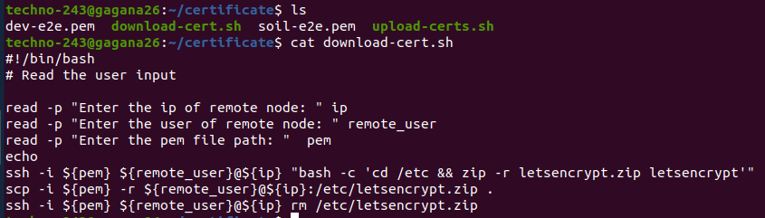
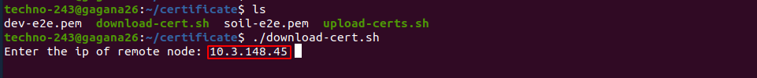
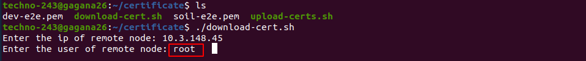
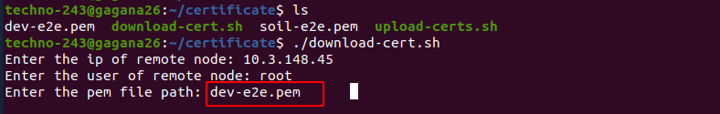
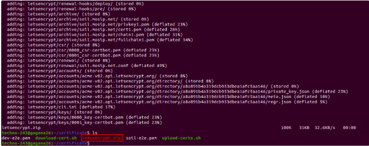
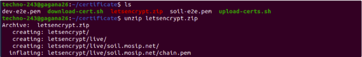
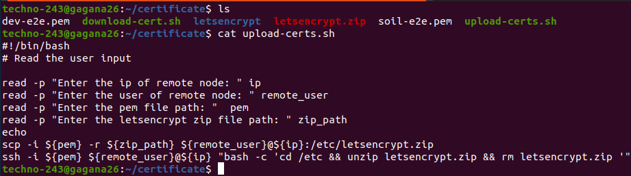
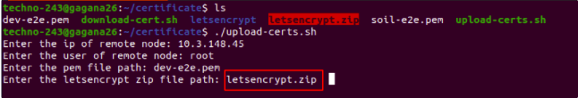
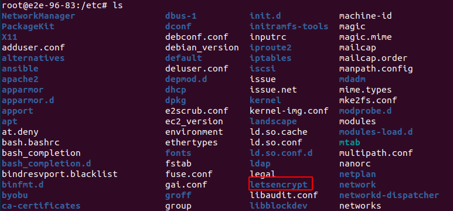
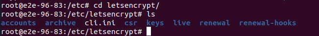

# Scripts to save certificates

## While dismantling our environments sometimes we need to save the Letsencrypt certificate issued for the domain name.

1. Script such that it can be run from a client machine that will zip the certs on host and download them to the client  machine .
2. Reverse script to upload the certificates at the right place before starting to install.

**1. Script such that it can be run from a client machine that will zip the certs on host and download them to the client  machine .**

* Script to download certificates from host machine to client machine
   
* read -p "Enter the ip of remote node: " ip  = enter the server ip address
   
* read -p "Enter the user of remote node: " remote_user = enter the remote_username, root is the user on the remote server
   
* read -p "Enter the pem file path: "  pem =  enter the pem key of that host machine
   
* ssh -i ${pem} ${remote_user}@${ip} "bash -c 'cd /etc && zip -r letsencrypt.zip letsencrypt'" = it is cd into the  /etc  folder, then it is zipping the letsencrypt folder into the letsencrypt.zip file
   
* scp -i ${pem} -r ${remote_user}@${ip}:/etc/letsencrypt.zip . =  the letsencrypt zip file is being copied to the local client machine
   
* ssh -i ${pem} ${remote_user}@${ip} rm /etc/letsencrypt.zip = here we are deleting the letsencrypt zip file in the virtual machine
   

**2. Reverse script to upload the certificates at the right place before starting to install.**

* Script to upload certificates from client machine to host machine
   
* read -p "Enter the ip of remote node: " ip  = enter the server ip address
   
* read -p "Enter the user of remote node: " remote_user = enter the remote_username, root is the user on the remote server
   
* read -p "Enter the pem file path: "  pem =  enter the pem key of that host machine
   
* read -p "Enter the letsencrypt zip file path: " zip_path = enter the path where the zip file is present
  
* scp -i ${pem} -r ${zip_path} ${remote_user}@${ip}:/etc/letsencrypt.zip = here it is taking the zip file as argument, sending that zip file out to the remote node again, copying it back
   
* ssh -i ${pem} ${remote_user}@${ip} "bash -c 'cd /etc/letsencrypt.zip && unzip letsencrypt.zip && rm letsencrypt.zip '" = it is going to unzip letsencrpt.zip file  and removing back
  