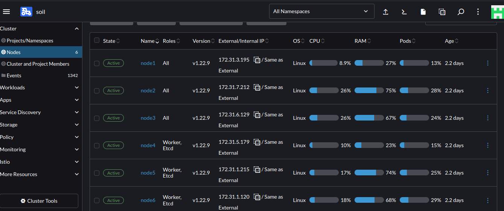

# ETCD Backup And Restore vis RKE

## Introduction

* The state of a Kubernetes cluster is maintained in [etcd](https://kubernetes.io/docs/concepts/overview/components/#etcd). 
  The etcd nodes run the etcd database.
* The etcd database component is a distributed key-value store used as Kubernetes storage for all cluster data, such as cluster coordination and state management.
  It is recommended to run etcd on multiple nodes so that there's always a backup available for fail over.
* For more details, please visit [here](https://ranchermanager.docs.rancher.com/reference-guides/kubernetes-concepts#etcd-nodes).

## Backup

* To capture the current state of the Kubernetes (k8s) cluster, execute the following command after updating the name of the snapshot with a unique identifier (i.e., `<etcd-snapshot-name>`).
    * Ensure that the directory from which the command is executed contains the following files
      * `cluster.rkestate`
      * `cluster.yml`
      * `kube_config_cluster.yml`
    * Update the SSH pem key location in the `cluster.yml` file.
    * Verify that the Kubernetes cluster nodes are accessible from the location where the command will be executed.
    ```
    rke etcd snapshot-save --config cluster.yml --name <etcd-snapshot-name>
    ```
    Example:
    ```
      $ rke etcd snapshot-save --config cluster.yml --name soil-2024-02-01T20:23:31Z_etcd
        INFO[0000] Running RKE version: v1.3.10                 
        INFO[0000] Starting saving snapshot on etcd hosts       
        INFO[0000] [dialer] Setup tunnel for host [172.31.1.120]
        INFO[0000] [dialer] Setup tunnel for host [172.31.3.195]
        .....
        .....
        INFO[0037] [etcd] Successfully started [etcd-snapshot-once] container on host [172.31.1.120] 
        INFO[0037] Waiting for [etcd-snapshot-once] container to exit on host [172.31.1.120]
        INFO[0037] Container [etcd-snapshot-once] is still running on host [172.31.1.120]: stderr: [time="2024-02-01T14:56:38Z" level=info msg="Initializing Onetime Backup" name="soil-2024-02-01T20:23:31Z_etcd"
        ], stdout: []
        INFO[0038] Waiting for [etcd-snapshot-once] container to exit on host [172.31.1.120]
        INFO[0039] Container [etcd-snapshot-once] is still running on host [172.31.1.120]: stderr: [time="2024-02-01T14:56:38Z" level=info msg="Initializing Onetime Backup" name="soil-2024-02-01T20:23:31Z_etcd"
        ], stdout: []
        INFO[0040] Waiting for [etcd-snapshot-once] container to exit on host [172.31.1.120]
        INFO[0040] Removing container [etcd-snapshot-once] on host [172.31.1.120], try #1
        INFO[0040] Finished saving/uploading snapshot [soil-2024-02-01T20:23:31Z_etcd] on all etcd hosts
    ```
    * The snapshot will be stored on all the nodes of k8s cluster under `/opt/rke/etcd-snapshots`. Login to one of the cluster nodes & verify.
      ```
      $ ssh -i /home/techno-384/Downloads/pem-keys/mosip-qa.pem ubuntu@172.31.1.12
      ....
      ....
      ubuntu@ip-172-31-1-120:~$ cd /opt/rke/etcd-snapshots/
      ubuntu@ip-172-31-1-120:/opt/rke/etcd-snapshots$ ls -lh
      total 41M
      -rw------- 1 root root 8.8M Jan 30 22:15 2024-01-30T22:15:19Z_etcd.zip
      -rw------- 1 root root 8.5M Jan 31 10:15 2024-01-31T10:15:19Z_etcd.zip
      -rw------- 1 root root 8.2M Jan 31 22:15 2024-01-31T22:15:19Z_etcd.zip
      -rw------- 1 root root 7.9M Feb  1 10:15 2024-02-01T10:15:19Z_etcd.zip
      -rw------- 1 root root 7.8M Feb  1 14:56 soil-2024-02-01T20:23:31Z_etcd.zip   ##### Here is the snapshot
      ```

* To enable recurring backup for the k8s cluster, update the `backup_config` section under `services` ---> `etcd` in `cluster.yml` and execute `rke up` command. 
  ```
  services:
    etcd:
      ....
      ....
      ....
      backup_config:
        interval_hours: 12
        retention: 6
  ```

## Restore

* To restore the state of the Kubernetes (k8s) cluster from a etcd snapshot, execute the following command after updating the name of the snapshot (i.e., `<etcd-snapshot-name>`).
  * Ensure that the directory from which the command is executed contains the following files
    * `cluster.rkestate`
    * `cluster.yml`
    * `kube_config_cluster.yml`
    * `etcd snapshot file` : you can get it from one of cluster nodes under `/opt/rke/etcd-snapshots/` location.
  * Update the SSH pem key location in the `cluster.yml` file.
  * Verify that the Kubernetes cluster nodes are accessible from the location where the command will be executed.
  ```
  rke etcd snapshot-restore --config cluster.yml --name <etcd-snapshot-name>
  ```
  Example:
  ```
  $ rke etcd snapshot-restore --config cluster.yml --name soil-2024-02-01T20:23:31Z_etcd
  ....
  ....
  INFO[0265] [addons] Setting up user addons              
  INFO[0265] [addons] no user addons defined              
  INFO[0265] Finished building Kubernetes cluster successfully
  INFO[0265] Restarting network, ingress, and metrics pods
  I0201 21:09:42.691615   14481 request.go:665] Waited for 1.043236434s due to client-side throttling, not priority and fairness, request: DELETE:https://172.31.6.129:6443/api/v1/namespaces/kube-system/pods/coredns-8578b6dbdd-776g5?timeout=30s
  INFO[0268] Finished restoring snapshot [soil-2024-02-01T20:23:31Z_etcd.zip] on all etcd host
  ```
  * Once the restore operation is successfully executed, check the status of nodes and pods of k8s cluster.
    
  