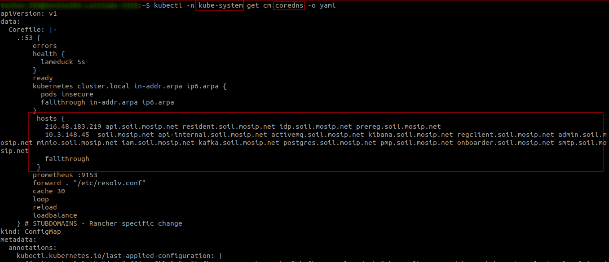
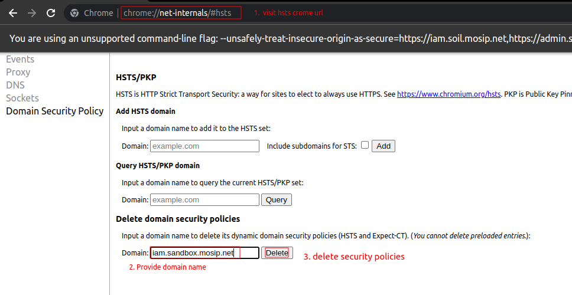
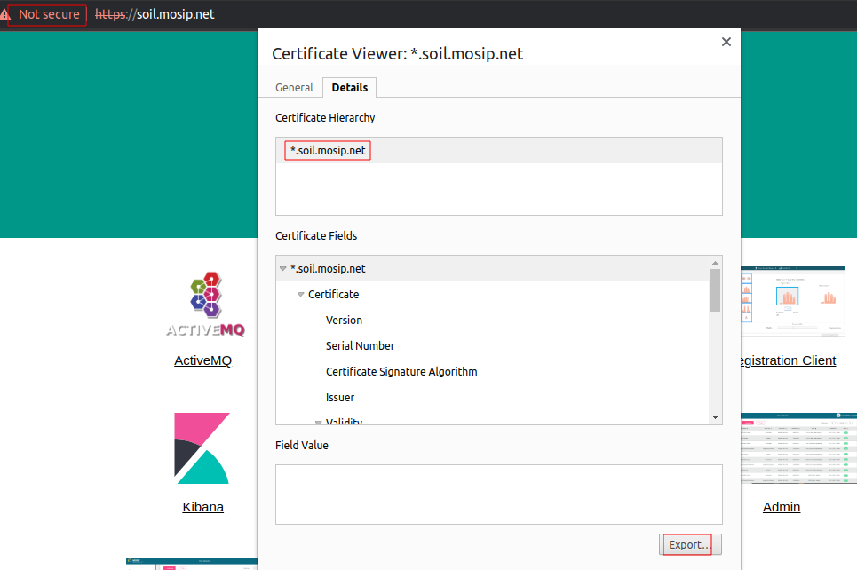
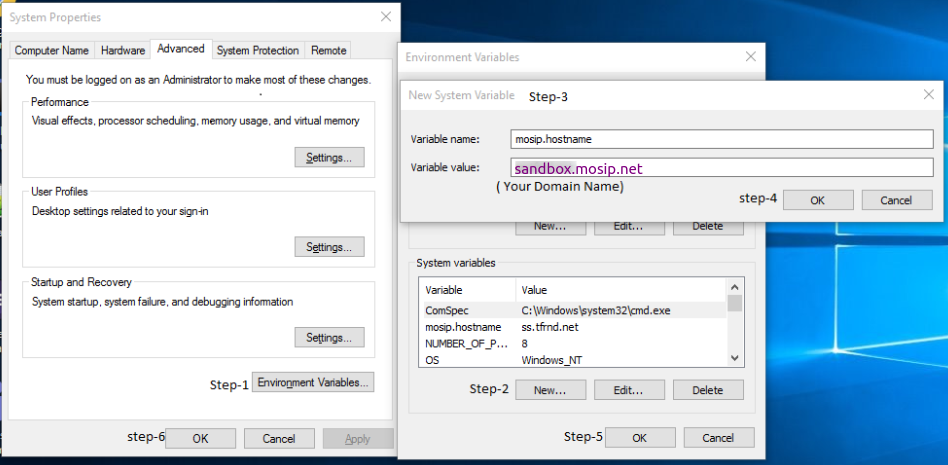

# MOSIP installation without public DNS

## Prerequisites
* [openssl](https://www.openssl.org/)

## Nginx setup
* Generate self-signed certificate for domain `*.sandbox.xyz.net`.
    * Update the below variables based on requirements.
      ```
      $ export VALIDITY=730
      $ export COUNTRY=IN
      $ export STATE=KAR
      $ export LOCATION=BLR
      $ export ORG=MOSIP
      $ export ORG_UNIT=MOSIP
      $ export COMMON_NAME=*.sandbox.xyz.net
      ```
    * Generate a self-signed certificate.
      ```
      sudo openssl req -x509 -nodes -days $VALIDITY -newkey rsa:2048 \
      -keyout /etc/ssl/private/nginx-selfsigned.key \
      -out /etc/ssl/certs/nginx-selfsigned.crt \
      --subj "/C=$COUNTRY/ST=$STATE/L=$LOCATION/O=ORG/OU=$ORG_UNIT/CN=$COMMON_NAME/"
      ```

* Use below mentioned details when prompted in install scripts:
    1. fullChain path: `/etc/ssl/certs/nginx-selfsigned.crt`.
    1. privKey path: `/etc/ssl/private/nginx-selfsigned.key`.

* Add the below section in the http block in the `/etc/nginx/nginx.conf` file. Update `<IAM_DOMAIN>`, `<cluster-nginx-internal-ip>` and restart the nginx service.
  ```
  http{
      server{
         listen <cluster-nginx-internal-ip>:80;
         server_name <IAM_DOMAIN>;
         location /auth/realms/mosip/protocol/openid-connect/certs {
              proxy_pass                      http://myInternalIngressUpstream;
              proxy_http_version              1.1;
              proxy_set_header                Upgrade $http_upgrade;
              proxy_set_header                Connection "upgrade";
              proxy_set_header                Host $host;
              proxy_set_header                Referer $http_referer;
              proxy_set_header                X-Real-IP $remote_addr;
              proxy_set_header                X-Forwarded-For $proxy_add_x_forwarded_for;
              proxy_set_header                X-Forwarded-Proto $scheme;
              proxy_pass_request_headers      on;
              proxy_set_header  Strict-Transport-Security "max-age=0;";
         }
         location / { return 301 https://iam.soil.mosip.net; }
      }
  }
  ```

## K8S coredns setup
* Once the cluster is created, we can set up custom DNS for the cluster.
* Update the IP address and domain name in the below section and add it in the coredns configmap `Corefile` key in the `kube-system` namespace.
  ```
   hosts {
     <PUBLIC_IP>    api.sandbox.xyz.net resident.sandbox.xyz.net idp.sandbox.xyz.net prereg.sandbox.xyz.net
     <INTERNAL_IP>  sandbox.xyz.net api-internal.sandbox.xyz.net activemq.sandbox.xyz.net kibana.sandbox.xyz.net regclient.sandbox.xyz.net admin.sandbox.xyz.net minio.sandbox.xyz.net iam.sandbox.xyz.net kafka.sandbox.xyz.net postgres.sandbox.xyz.net pmp.sandbox.xyz.net onboarder.sandbox.xyz.net smtp.sandbox.xyz.net
     fallthrough
   }
  ```
  
* Restart the `coredns` pod in the `kube-system` namespace.

## Update config properties
* Update the below variable in `admin-default.properties`, `resident-default.properties`, and `partner-default.properties`.
  ```
  mosip.iam.certs_endpoint=http://${keycloak.external.host}/auth/realms/mosip/protocol/openid-connect/certs
  ```
* Restart admin, resident, and partner services.

## Local setup

### DNS setup
* Map IP address and domain names to set up DNS in the respective `hosts` file. <br>
  For example: `/etc/hosts` files for Linux machines.
  ```
   <PUBLIC_IP>    api.sandbox.xyz.net resident.sandbox.xyz.net idp.sandbox.xyz.net prereg.sandbox.xyz.net
   <INTERNAL_IP>  sandbox.xyz.net api-internal.sandbox.xyz.net activemq.sandbox.xyz.net kibana.sandbox.xyz.net regclient.sandbox.xyz.net admin.sandbox.xyz.net minio.sandbox.xyz.net iam.sandbox.xyz.net kafka.sandbox.xyz.net postgres.sandbox.xyz.net pmp.sandbox.xyz.net onboarder.sandbox.xyz.net smtp.sandbox.xyz.net
  ```
* Visit `https://sandbox.xyz.net/` on any browser to test DNS working.

### Browser setup
* Delete `hsts` security policies for listed domains.
    * open `hsts` setting in any browser example: `chrome://net-internals/#hsts`.
    * Provide domain name `iam.sandbox.xyz.net`and click on `delete`.
      
    * Repeat the same for other domains.

### Reg-client setup
* Download & unzip reg-client.
* Make sure to have a `Windows` machine.
* Export self-signed certificate from browser to the reg-client directory with name `_.sandbox.xyz.net.cer`.
  
* Add self-signed certificate to cacerts keystore.
    * Open terminal under reg-client.
    * Update the domain below command and run it on the terminal to a self-signed certificate to cacerts keystore.
      ```
      XXXXX\reg-client> jre\bin\keytool -import -trustcacerts -alias api-internal.sandbox.xyz.net -file %CD%\_.soil.mosip.net.cer -keystore %CD%\jre\lib\security\cacerts -noprompt -storepass changeit
      
      Warning: use -cacerts option to access cacerts keystore
      Certificate was added to keystore
      ```
    * Set `mosip.hostname` environmental variables.
      ```
      mosip.hostname=sandbox.mosip.net
      ```
      
