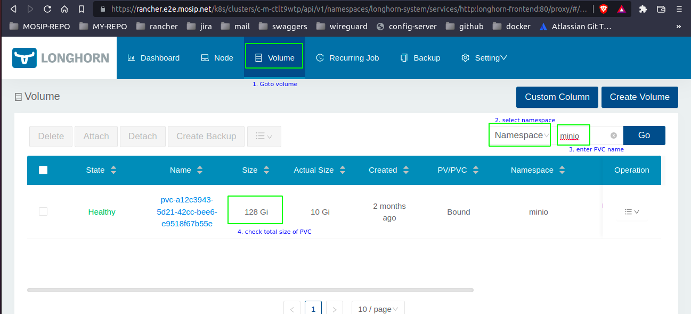

# Resize Existing PVC Storage

## Resize
To resize existing PVC storage, follow the below procedure:
1. Set `resource` replicas to zero (0).
   ```
   kubectl -n resourceNameSpace scale --replicas=0 resourceObjectName resourceName
   ```
   eg.:
   ```
   kubectl -n minio scale --replicas=0 deploy minio
   ```
2. Resize `PVC` storage.
   ```
   kubectl -n resourceNameSpace edit pvc pvcName
   ```
   eg.: resize minio PVC to 128GB. <br>To resize minio pvc to 128GB, we need to update capacity storage under `status` section.
   ```
   $ kubectl -n minio edit pvc minio
    spec:
       accessModes:
       - ReadWriteOnce
       resources:
         requests:
           storage: 128Gi   ##### update the storage capacity
       storageClassName: longhorn
       volumeMode: Filesystem
       volumeName: pvc-ccd5a77e-287d-41e2-af39-b63230a9a577
   ```
3. Check if the same is reflected on longhorn UI
   
4. Set `resource` replicas to one (1).
   ```
   kubectl -n resourceNameSpace scale --replicas=1 resourceObjectName resourceName
   ```
   eg.:
   ```
   kubectl -n minio scale --replicas=1 deploy minio
   ```
## Troubleshooting
In case the system is less on storage and pv gets into the resizing state due to less available storage then follow the below mentioned steps:
* Change the reclaim policy of the desired underlying  PV to Retain mode.
* Take the backup of the pvc yaml of the postgres.
* Delete the pvc.
* To ensure that the newly created PVC can bind to the PV marked Retain, manually edit the PV and delete the claimRef entry from the PV specs. This marks the PV as Available.
* Re-create the PVC in a smaller size, or a size that can be allocated by the underlying storage provider.
* Set the volumeName field of the PVC to the name of the PV. This binds the PVC to the provisioned PV only.
* Update the no of replicas for required PV to 2, this created one more volume on node5.
* Reduce the replica count of the required PV again back to 1.
* Remove the volumes copy which was there in previous existing node with less storage.
* Update the pvc of the postgres to higher allocatable size.
* Increase back the replication of the required resource attached to the pvc.