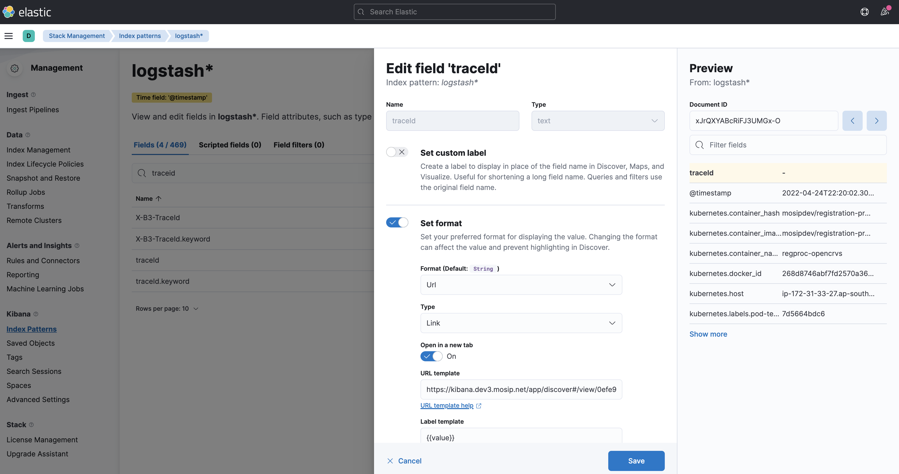

# Logging

## Kibana
Kibana connects to Elasticsearch. Make sure you have a domain like `kibana.sandbox.xyz.net` pointing to your internal load balancer included in [global configmap](../mosip/global_configmap.yaml.sample).

## Install Elasticsearch, Kibana and Istio addons
```sh 
./install.sh
```

## Install Rancher FluentD system
1. Install Logging from Apps and marketplace within the Rancher UI.
1. Select Chart Version `100.1.3+up3.17.7` from Rancher console -> _Apps & Marketplaces_.

## Add _Index Lifecycle Policy_ and  _Index Template_ to Elasticsearch
```sh
./elasticsearch-ilm-script.sh
```
## Configure Rancher FluentD
To collect logs from MOSIP services create _ClusterOutputs_ as belows:
* Select _Logging_ from Cluster Explorer.
* Use the following command to create `elasticsearch` _ClusterOutput_.
```
kubectl apply -f clusteroutput-elasticsearch.yaml
```
* Use the following command to create `mosip-logs` _ClusterFlow_.
```
kubectl apply -f clusterflow-elasticsearch.yaml
```
    
TODO: Issues: Elasticsearch and Kibana pod logs are not getting recorded. Further, setting up Cluster Flow for pods specified by pod labels doesn't seem to work. Needs investigation.

## Elasticsearch indices 
Day wise indices with the name `logstash*` are created once the above dashboards are imported. The `logstash_format: true` setting above enables the same.

To see day wise logs indices created in Elasticsearch login to one of the Master pods of Elasticsearch via Rancher and issue following command:
```
curl http://localhost:9200/_cat/indices | grep logstash
```
**Cleanup**: You may archive or delete older logs.

## Filters
Note the filters applied in [clusterflow-elasticsearch.yaml](clusterflow-elasticsearch.yaml). You may update the same for your install if required. 

## Dashboards
### Load
* Run the following to load all dashboards in the [`./dashboards`](./dashboards) folder to Kibana.
```sh
./load_kibana_dashboards.sh ./dashboards <cluster-kube-config-file>
```
### View
* _Kibana_ --> _Menu_ (on top left) --> _Dashboard_ --> Select the dashboard
### Delete
* Run the following to delete all dashboards in the [`./dashboards`](./dashboards) folder from Kibana.
```sh
./delete_kibana_dashboards.sh ./dashboards <cluster-kube-config-file>
```

## TraceId
You can click the `traceId` field to see the full log trace related to the particular `traceId`. The dashboard `02-error-only-logs.ndjson` contains field map for the same.  To setup such links manually, provide the following URL in the given view of _Saved Objects_ --> _logstash_ --> _traceId_.


 
```
kibana#/discover/0efe9240-c521-11ec-92b4-4f5e54b3d2f7?_g=(filters:!(),refreshInterval:(pause:!t,value:10000),time:(from:now-15m,to:now))&_a=(columns:!(kubernetes.container_name,traceId,level,message),filters:!(('$state':(store:appState),meta:(alias:!n,disabled:!f,index:'1edfabd0-c3d8-11ec-a947-83cd2093795e',key:traceId.keyword,negate:!f,params:(query:'{{value}}'),type:phrase),query:(match_phrase:(traceId.keyword:'{{value}}')))),grid:(),hideChart:!f,index:'1edfabd0-c3d8-11ec-a947-83cd2093795e',interval:auto,query:(language:kuery,query:''),sort:!(!('@timestamp',desc)))
```

## Troubleshooting
* If MOSIP logs are not seen, check if all fields here have quotes (except numbers):
Log pattern in [mosip-config](https://github.com/mosip/mosip-config/blob/develop3-v3/application-default.properties) property `server.tomcat.accesslog.pattern`.
* To check latest record in Elasticsearch index, login to any of Elasticsearch Master pod's shell (using Rancher or `kubectl exec`):
    ```sh
    curl -X POST -H 'Content-Type: application/json' -d '{ "query": { "match_all": {} }, "size": 1, "sort": [ { "@timestamp": { "order": "desc" } } ] }' http://localhost:9200/<index-name>/_search
    ```
