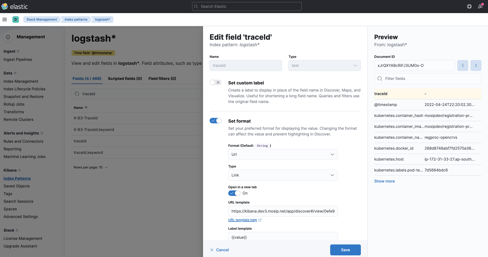

# Logging

## Kibana
Kibana connects to Elasticsearch. Make sure you have a domain like `kibana.sandbox.xyz.net` pointing to your internal load balancer included in [global configmap](../mosip/global_configmap.yaml.sample).

## Install Elasticsearch, Kibana, Istio addons and logging operator.
```sh 
./install.sh
```
Note: Before running the `install.sh` script please make sure the `values.yaml` and the host value in 'istio-addons-values.yaml' is updated. 

## Install logging operator. 
There are two ways to install logging operator as given below:

### Using Helm charts:

* Update the `values.yaml` file based on your requiremnt before installing logging operator.
* Running `install.sh` will deploy logging operator with Elasticsearch, Kibana, Istio addons within your kubernetes cluster.

Note: 
* There is no need to install logging operator separately from rancher-ui as we are installing logging operator as a part of `install.sh` script.
* Using helm charts will deploy `103.1.1+up4.4.0` version of logging operator.

### Using Rancher-ui:
* Install Logging operator from Apps and marketplace within the Rancher UI.
* Select Chart Version `103.1.1+up4.4.0` from Rancher console -> _Apps & Marketplaces_.

## Add _Index Lifecycle Policy_ and  _Index Template_ to Elasticsearch
```sh
./elasticsearch-ilm-script.sh
```
## Configure Rancher FluentD
To collect logs from MOSIP services create _ClusterOutputs_ as belows:
* Select _Logging_ from Cluster Explorer.
* Use the following command to create `elasticsearch` _ClusterOutput_.
```
kubectl apply -f clusteroutput-elasticsearch.yaml
```
* Use the following command to create `mosip-logs` _ClusterFlow_.
```
kubectl apply -f clusterflow-elasticsearch.yaml
```
    
TODO: Issues: Elasticsearch and Kibana pod logs are not getting recorded. Further, setting up Cluster Flow for pods specified by pod labels doesn't seem to work. Needs investigation.

## Elasticsearch indices 
Day wise indices with the name `logstash*` are created once the above dashboards are imported. The `logstash_format: true` setting above enables the same.

To see day wise logs indices created in Elasticsearch login to one of the Master pods of Elasticsearch via Rancher and issue following command:
```
curl http://localhost:9200/_cat/indices | grep logstash
```
**Cleanup**: You may archive or delete older logs.

## Filters
Note the filters applied in [clusterflow-elasticsearch.yaml](clusterflow-elasticsearch.yaml). You may update the same for your install if required. 

## Dashboards
### Load
* Run the following to load all dashboards in the [`./dashboards`](./dashboards) folder to Kibana.
```sh
./load_kibana_dashboards.sh ./dashboards <cluster-kube-config-file>
```
### View
* _Kibana_ --> _Menu_ (on top left) --> _Dashboard_ --> Select the dashboard
### Delete
* Run the following to delete all dashboards in the [`./dashboards`](./dashboards) folder from Kibana.
```sh
./delete_kibana_dashboards.sh ./dashboards <cluster-kube-config-file>
```

## TraceId
You can click the `traceId` field to see the full log trace related to the particular `traceId`. The dashboard `02-error-only-logs.ndjson` contains field map for the same.  To setup such links manually, provide the following URL in the given view of _Saved Objects_ --> _logstash_ --> _traceId_.


 
```
kibana#/discover/0efe9240-c521-11ec-92b4-4f5e54b3d2f7?_g=(filters:!(),refreshInterval:(pause:!t,value:10000),time:(from:now-15m,to:now))&_a=(columns:!(kubernetes.container_name,traceId,level,message),filters:!(('$state':(store:appState),meta:(alias:!n,disabled:!f,index:'1edfabd0-c3d8-11ec-a947-83cd2093795e',key:traceId.keyword,negate:!f,params:(query:'{{value}}'),type:phrase),query:(match_phrase:(traceId.keyword:'{{value}}')))),grid:(),hideChart:!f,index:'1edfabd0-c3d8-11ec-a947-83cd2093795e',interval:auto,query:(language:kuery,query:''),sort:!(!('@timestamp',desc)))
```

## Troubleshooting
* If MOSIP logs are not seen, check if all fields here have quotes (except numbers):
Log pattern in [mosip-config](https://github.com/mosip/mosip-config/blob/develop3-v3/application-default.properties) property `server.tomcat.accesslog.pattern`.
* To check latest record in Elasticsearch index, login to any of Elasticsearch Master pod's shell (using Rancher or `kubectl exec`):
    ```sh
    curl -X POST -H 'Content-Type: application/json' -d '{ "query": { "match_all": {} }, "size": 1, "sort": [ { "@timestamp": { "order": "desc" } } ] }' http://localhost:9200/<index-name>/_search
    ```
## Symptoms

If you are experiencing any of the following, these fixes apply to you:
- `fluentd` pods stuck in `CrashLoopBackOff` or restarting repeatedly
- OOMKilled events on `fluentd` or `fluent-bit` pods
- Elasticsearch indexing errors or high backpressure from the logging pipeline
- Log parsing failures or unparsed logs appearing in Elasticsearch

---

## Changes and What to Update

### 1. Log Parsing & Filters (`logging/clusterflow-elasticsearch.yaml`)

**What changed:**  
The previous single JSON parser has been replaced with a `multi_format` parser that handles multiple log shapes — two regex patterns, one JSON parser, and a `none` fallback. Additionally:

- `reserve_data` is now preserved, and `remove_key_name_field` is enabled.
- The actuator endpoint grep filter has been removed and replaced with expanded exclusions covering both `actuator/health` and `actuator/prometheus`.
- The Temporary Store exclusion pattern has been shortened for broader matching.

**Action for existing users:**  
Re-apply `logging/clusterflow-elasticsearch.yaml` from the updated branch:

```bash
kubectl apply -f logging/clusterflow-elasticsearch.yaml
```

If you have custom grep/filter rules, make sure your exclusion patterns are compatible with the new `multi_format` parser structure.
 
---

### 2. Elasticsearch Output Configuration (`logging/clusteroutput-elasticsearch.yaml`)

**What changed:**  
The Elasticsearch output buffer has been restructured to prevent memory exhaustion when Elasticsearch is slow or unreachable:

| Setting | Old | New |
|---|---|---|
| `logstash_format` | removed | reintroduced |
| `suppress_type_name` | absent | added |
| `log_es_400_reason` | absent | added |
| `flush_interval` | flat/absent | `5s` |
| `flush_mode` | flat/absent | `interval` |
| `chunk_limit_size` | absent | `8MB` |
| `overflow_action` | absent | `drop_oldest_chunk` |
| `ssl_verify` / `ssl_version` | present | removed |

**⚠️ Important note — silent log loss:**  
`overflow_action: drop_oldest_chunk` prevents OOM crashes but will silently drop the oldest buffered log chunks when the buffer is full. This is a deliberate trade-off for stability. If Elasticsearch is unavailable for a prolonged period, older logs may be lost without any alert. Consider adding a PrometheusRule to monitor `fluentd_output_status_buffer_total_bytes` and `fluentd_output_status_retry_count` if log completeness is critical for your deployment.

**Action for existing users:**

```bash
kubectl apply -f logging/clusteroutput-elasticsearch.yaml
```

If you have `ssl_verify: false` or `ssl_version` set explicitly, remove those fields — they are no longer supported/needed in this config.
 
---

### 3. Elasticsearch Cluster Values (`logging/es_values.yaml`)

**What changed:**
- `tolerations: {}` has been added for `data.resources` and `master.resources` nodes to improve scheduling flexibility.
- A new **coordinating-only node** has been introduced with explicit `resources` (limits and requests) and `heapSize: 1g`, along with heap-sizing comments for tuning guidance.

**Action for existing users:**  
Apply the updated values to your Elasticsearch Helm release. Adjust `heapSize` according to your cluster's available memory before applying:

```bash
helm upgrade --install elasticsearch \
  -f logging/es_values.yaml \
  <your-chart-repo>/elasticsearch \
  -n logging
```

The coordinating node is a new addition — it will create a new pod. Ensure your cluster has enough node capacity before applying.
 
---

### 4. Fluent Bit / Fluentd Values & Storage (`logging/values.yaml`)

**What changed:**  
This is the most impactful change for resolving the CrashLoopBackOff. The following have been added or updated:

**Fluent Bit tail buffer tuning:**

```yaml
Buffer_Chunk_Size: 2M
Buffer_Max_Size: 10M
Mem_Buf_Limit: 50M
```

**Filesystem-backed storage for Fluent Bit (reduces in-memory pressure):**

```yaml
storageType: filesystem
storagePath: /buffers/fluent-bit
Path: <log-path>
RefreshInterval: <interval>
```

**New `emptyDir` volume and mount for buffer storage:**

```yaml
volumes:
  - name: fluent-bit-buffer
    emptyDir:
      sizeLimit: 2Gi
volumeMounts:
  - name: fluent-bit-buffer
    mountPath: /buffers/fluent-bit
```

**Explicit resource limits for Fluent Bit and Fluentd pods** (prevents unbounded memory growth).