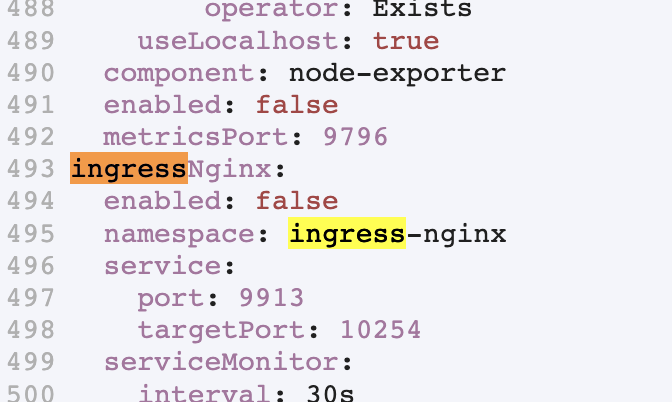

# Cluster Monitoring

## Install
Prometheus and Graphana tools are used to monitor the cluster. Install as given below: 
1. Select 'Monitoring' App from  Rancher console -> _Apps & Marketplaces_. 
1. In Helm options, open the YAML file and disable Nginx Ingress. 

    

1. Click on 'Install'.

## Prometheus
All MOSIP modules have been configured to let Prometheus scrape metrics.

## Grafana
To load a new dashboards to Grafana, sign in with user and password from `rancher-monitoring-grafana` in `cattle-monitoring-system` namespace of Rancher cluster.

To see JVM stats you may import chart number `14430` in Grafana dashboard.
