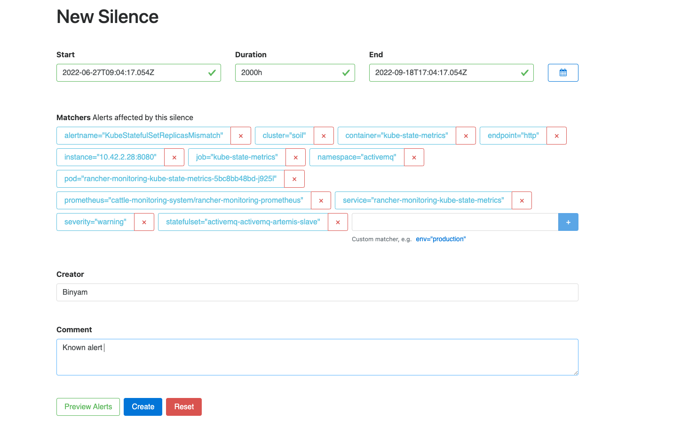
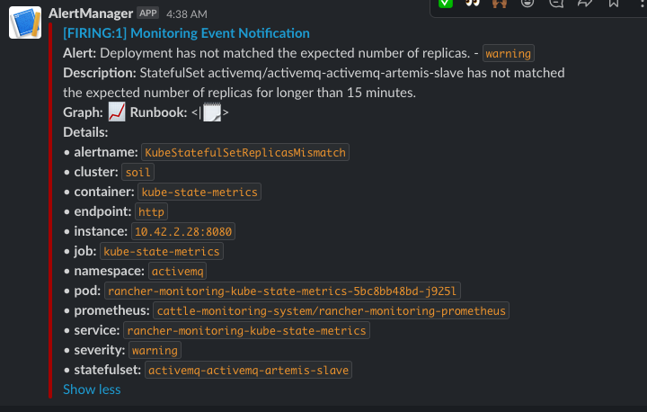

# Cluster Alerting

Alerting is part of cluster monitoring, where alert notifications are sent to the configured email or slack channel

## Prerequisite

Prometheus, Grafana, and alert manager tools are needed to set up alert notifications. [Install monitoring](../README.md).

## Slack alerts notification

- Creating slack incoming webhook [here](https://api.slack.com/messaging/webhooks), 
- update ``slack_api_url`` and ``channel`` in ``alertmanager.yaml`` 
- run ``./install.sh `` to patch alertmanager.

## Creating custom alerts

The monitoring package provided by rancher has various default alerting rules, most of the time the default rules are enough. Sample custom alerts are provided under ``custom-alerts``. Modify the same and apply using ``kubectl`` 

## Silence/Mute alerts

- Go to alertmanager under monitoring tab in rancher ui 
- Click on the alert -> silence, add appropriate silence duration, creator, and comment  

## Add cluster name to the alert

When having multiple clusters, you can add a cluster name to be presented as part of alert information. Here our cluster name is soil. 

- Add cluster name in,  ``patch-cluster-name.yaml``
- Run  ``install.sh``

