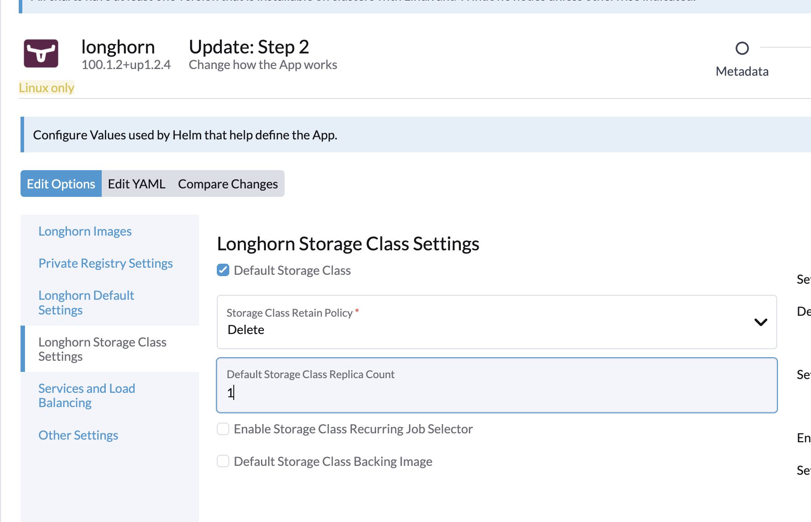

# Longhorn Persistence Storage

## Introduction
[Longhorn](https://longhorn.io) is a persistant storage provider that installs are storage class `longhorn` on the cluster.

## Prerequisites
```sh
./pre_install.sh
```

## Longhorn
* Install using Rancher UI as given [here](https://longhorn.io/docs/latest/deploy/install/install-with-rancher/).
* In Helm options of Longhorn, set the replicas for stroage class appropriately. For sandbox, replica of 1 would suffice otherwise storage consumption will be very high. For production, keep the default count.

 

* For cloud-native install disable default storage class flag. This will ensure that cloud providers' storage class shall be used as default. 
	```
	$ kubectl patch storageclass longhorn -p '{"metadata": {"annotations":{"storageclass.kubernetes.io/is-default-class":"false"}}}'
	```
* Access Longhorn dashboard from Rancher.
* Review the "Reserved" space shown on Longhorn dashboard. This much disk space is not used by Longhorn. If the node storage is not used for any other purpose than MOSIP functionality, you may reduced the reserved space on every node by going to Node tab --> menu for each node on the right --> Edit node and disk --> Storage Reserved.

## Backup
For some basic tests and, how to setup an AWS S3 backupstore in Longhorn, refer [docs/longhorn-backupstore-and-tests.md](../../docs/longhorn-backupstore-and-tests.md).
