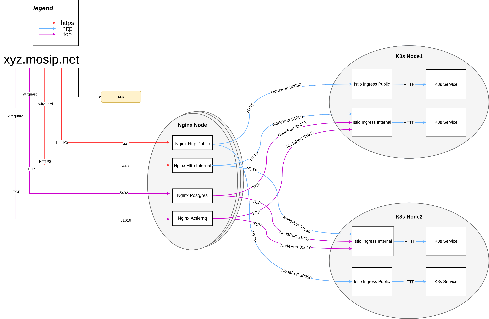

# NGINX Reverse Proxy Setup

## Introduction
* Nginx is used as a reverse proxy to direct traffic into the cluster via two channels - public and internal.
* The internal channel is front-ended by Wireguard. 
* The traffic is directed to NodePort of respective Ingress gateways (Istio). 
* The Nginx runs on a separate node that has access to public Internet and connects to services via nodeport.



## Prerequisites
* [Ansible](https://docs.ansible.com/ansible/latest/installation_guide/intro_installation.html).
* Provision one VM for Nginx, or multiple VMs for high avaiability like Nginx Plus.
* OS: Debian based. Recommended Ubuntu Server.
* [SSL certificates](../../../docs/wildcard-ssl-certs-letsencrypt.md).
* Make sure this Nginx node has two network interfaces:
    *  Public: Facing public Internet. _(Only required when accessing APIs over Intenet)_.
    *  Private: Must be on the same subnet as cluster nodes/machines.  Wireguard connects to this interface. 
* Command-line utilities:
  * `bash`
  * `sed`
* Nginx machine details are updated in `../hosts.ini`.
* Make sure wireguard is up and running as per [Wireguard instalation guide](https://docs.mosip.io/1.2.0/deployment/wireguard/wireguard-bastion).

## Installation
* Enable firewall with required ports:
```
ansible-playbook -i ../hosts.ini nginx_ports.yaml
```
* Configure nginx.conf and install nginx. 
```sh
 sudo ./install.sh
```
## Post installation
* After installation check Nginx status:
```
sudo systemctl status nginx
```
* Only after complete testing and checks enable [public access](../../../docs/public-access.md).

## Uninstall
* purge nginx-common to remove all the nginx related dependencies.
```
sudo apt purge nginx nginx-common
```
