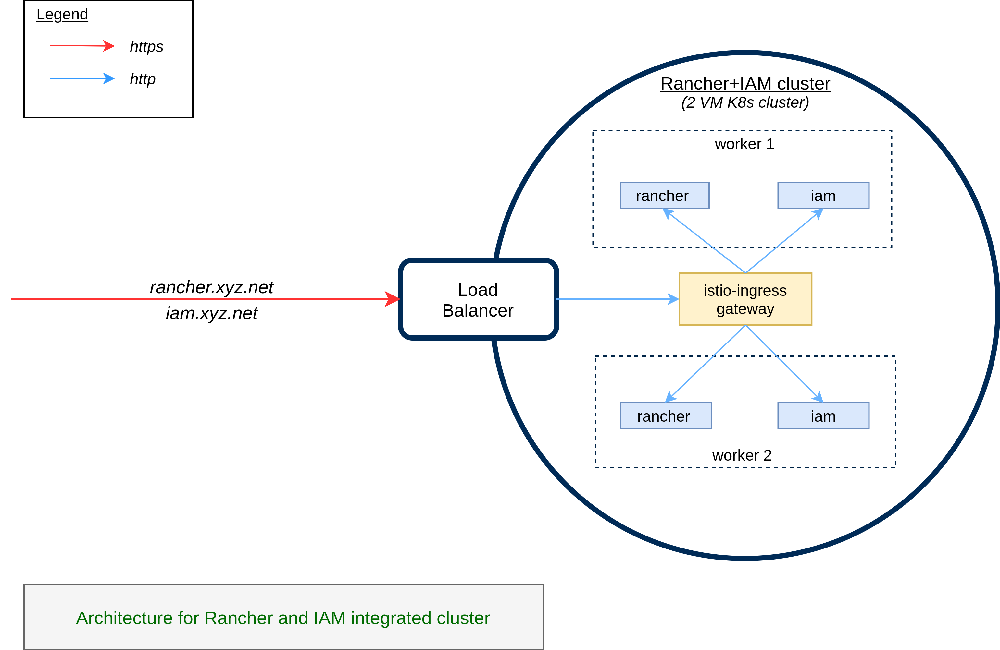

# Rancher Management Server

## Introduction
Rancher is used to manage multiple kubernetes clusters for the organisation. You will typically need one Rancher installation for an organisaton/project. Install Rancher before installation of MOSIP cluster. It is important to install Rancher in high availablity mode which is achived by installing it on a Kubernetes cluster.  The same cluster houses IAM [Keycloak](https://www.keycloak.org/).

## Architecture Diagram


## Utililties
* Install following command line utilities:
    * `kubectl`
    * `helm`
    * `rke`
    * `istioctl`
* Add Helm repos:
    ```sh
    helm repo add bitnami https://charts.bitnami.com/bitnami
    helm repo add mosip https://mosip.github.io/mosip-helm
    ```
## Kubernetes cluster installation
* [AWS](aws/README.md)
* [on-prem](on-prem/README.md)

## Rancher
* Install Rancher using Helm. For more details see [Rancher-ui guide](rancher-ui/README.md).

## Persistent storage
On Cloud hosted cluster, like AWS, built-in persistent storage options are available. Like AWS's EBS.  However, on an on-prem cluster, a persistent storage provider needs to be installed. Install Longhorn for persistence using [this](../cluster/longhorn).

## Keycloak
Refer [here](keycloak/README.md) for installation of Keycloak.

## Keycloak-Rancher integration
* Login as "admin" user in Keycloak and make sure an email id, and first name field is populated for "admin" user. This is important for Rancher authentication as given below.
* Enable authentication with Keycloak using the steps given [here](https://rancher.com/docs/rancher/v2.6/en/admin-settings/authentication/keycloak-saml/).
* In Keycloak add another Mapper for the rancher client (in Master realm) with following fields:
  * Protocol: saml
  * Name: username
  * Mapper Type: User Property
  * Property: username
  * Friendly Name: username
  * SAML Attribute Name: username
  * SAML Attribute NameFormat: Basic

* Specify the following mappings in Rancher's Authentication Keycloak form:
  * Display Name Field: givenName
  * User Name Field: email
  * UID Field: username
  * Entity ID Field: https://your-rancher-domain/v1-saml/keycloak/saml/metadata
  * Rancher API Host: https://your-rancher-domain
  * Groups Field: member

## RBAC
* For users in Keycloak assign roles in Rancher - **cluster** and **project** roles. Under `default` project add all the namespaces. Then, to a non-admin user you may provide Read-Only role (under projects).
* Add a member to cluster/project in Rancher:
  * Give member name exactly as `username` in Keycloak
  * Assign appropriate role like Cluster Owner, Cluster Viewer etc.
  * You may create new role with fine grained acccess control.
  
## Troubleshooting guide

Issue (1):Issue related to rkeup
[controlPlane] Failed to bring up Control Plane: [Failed to verify healthcheck: Failed to check https://localhost:6443/healthz for service

ERROR:
      ssh connection failed
      failed to bring up the controlPlane

ROOT CAUSE:
      Local host is not pointed correctly
      curl https://localhost:6443/healthz
      Could not resolve host: localhost

SOLUTION:
      We have to add localhost in to the /etc/hosts/
      127.0.0.1 localhost
      
Issue (2):Issue related to ingress-nginx.yaml

ERROR:
      Resource already exists and unable to continue with deployment

ROOTCAUSE:
      ingress-nginx is deployed with the rancher cluster deployment
			 
SOLUTION:
      After ingress provider:none We removed all lines till cluster name
      
Issue (3):Issue to rancher dashboard

ERROR:
      failed calling webhook at the time rancher ui installation

ROOT CAUSE:
      At the time of login to the dashboard unexpectedly changed random password and forgot to save the password,when i logout with the rancher not able       to login

SOLUTION:
      kubectl delete mutatingwebhookconfigurations.admissionregistration.k8s.io --ignore-not-found=true rancher.cattle.io
      mutatingwebhookconfiguration.admissionregistration.k8s.io "rancher.cattle.io" deleted (after using this command able to access rancher ui but not         able to login)
 
      https://rancher.com/docs/rancher/v2.5/en/faq/technical/
      Use this document to generate a new password

## Certificates expiry

In case you see certificate expiry message while adding users, on **local** cluster run these commands:

https://rancher.com/docs/rancher/v2.6/en/troubleshooting/expired-webhook-certificates/
